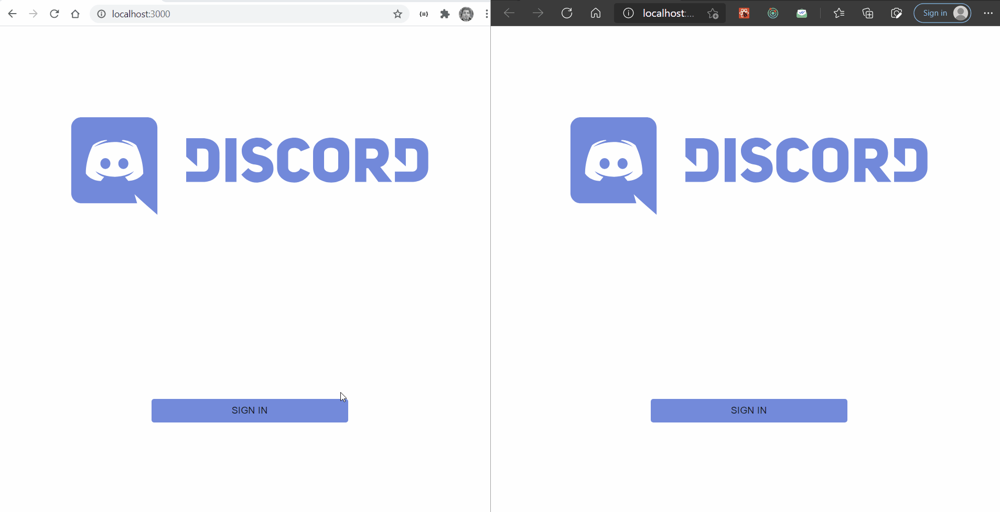
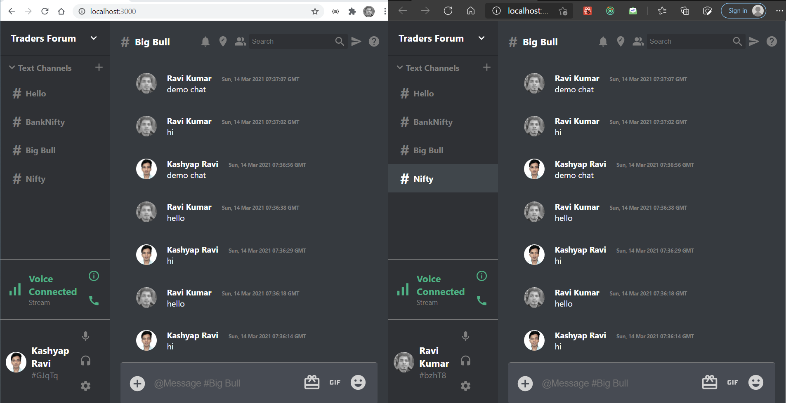

# Discord Clone Using React, Redux, Material-UI

To run this on your local system: 
## Installation Steps

1. Open cmd in frontend directory and just run, this should start installing your dependencies
```
npm install
```
2. After everything is done, run
```
npm start
```

Frontend Demo: https://discord-clone-using-react-js.vercel.app/



<br>

